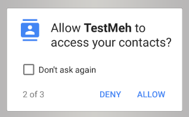

# Unity Android Runtime Permissions



**Available on Asset Store:** https://assetstore.unity.com/packages/tools/integration/android-runtime-permissions-117803

**Forum Thread:** https://forum.unity.com/threads/open-source-androidruntimepermissions-manage-runtime-permissions-synchronously-on-android-m.528833/

**Discord:** https://discord.gg/UJJt549AaV

**[GitHub Sponsors ☕](https://github.com/sponsors/yasirkula)**

*Based on UnityAndroidPermissions (MIT License): https://github.com/Over17/UnityAndroidPermissions*

This plugin helps you query/request runtime permissions on Android M and later. It also works on older Android versions and detects whether a requested permission is declared in AndroidManifest or not.

## INSTALLATION

There are 5 ways to install this plugin:

- import [RuntimePermissions.unitypackage](https://github.com/yasirkula/UnityAndroidRuntimePermissions/releases) via *Assets-Import Package*
- clone/[download](https://github.com/yasirkula/UnityAndroidRuntimePermissions/archive/master.zip) this repository and move the *Plugins* folder to your Unity project's *Assets* folder
- import it from [Asset Store](https://assetstore.unity.com/packages/tools/integration/android-runtime-permissions-117803)
- *(via Package Manager)* add the following line to *Packages/manifest.json*:
  - `"com.yasirkula.androidruntimepermissions": "https://github.com/yasirkula/UnityAndroidRuntimePermissions.git",`
- *(via [OpenUPM](https://openupm.com))* after installing [openupm-cli](https://github.com/openupm/openupm-cli), run the following command:
  - `openupm add com.yasirkula.androidruntimepermissions`

## HOW TO

Before we start, there is one optional step: by default, Unity shows a permission dialog on startup to prevent plugins from crashing/malfunctioning. This can be disabled, if you want; but you must make sure to handle all the runtime permissions carefully in your app's lifecycle. To disable this dialog, add the following line inside the `<application>...</application>` tag of *Plugins/Android/AndroidManifest.xml*:

```xml
<meta-data android:name="unityplayer.SkipPermissionsDialog" android:value="true" />
```

**NOTE:** if your project doesn't have an AndroidManifest, you can copy Unity's default one from *C:\Program Files\Unity\Editor\Data\PlaybackEngines\AndroidPlayer* (it might be located in a subfolder, like '*Apk*') to *Assets/Plugins/Android* ([credit](http://answers.unity3d.com/questions/536095/how-to-write-an-androidmanifestxml-combining-diffe.html)).

You can use the following *static* functions of **AndroidRuntimePermissions** to manage runtime permissions:

`bool CheckPermission( string permission )`: checks whether or not the permission is granted

`bool[] CheckPermissions( params string[] permissions )`: queries multiple permissions simultaneously. The returned array will contain one entry per queried permission

`Permission RequestPermission( string permission )`: requests a permission from the user and returns the result. It is recommended to show a brief explanation before asking the permission so that user understands why the permission is needed and doesn't click Deny or worse, "Don't ask again". **Permission** is an enum that can take 3 values: 
- **Granted**: permission is granted
- **ShouldAsk**: permission is denied but we can ask the user for permission once again. As long as the user doesn't select "Don't ask again" while denying the permission, ShouldAsk is returned
- **Denied**: we don't have permission and we can't ask the user for permission. In this case, user has to give the permission from app's Settings. This happens when user selects "Don't ask again" while denying the permission or when user is not allowed to give that permission (parental controls etc.)

`Permission[] RequestPermissions( params string[] permissions )`: requests multiple permissions simultaneously

`Task<Permission> RequestPermissionAsync( string permission )`: asynchronous version of *RequestPermission*. Unlike *RequestPermission*, this function doesn't freeze the app unnecessarily before the permission dialog is displayed

`Task<Permission[]> RequestPermissionsAsync( string[] permissions )`: asynchronous version of *RequestPermissions*

`void OpenSettings()`: opens the settings for this app, from where the user can manually grant permission(s) in case a needed permission's state is *Permission.Denied*

## EXAMPLE CODE

The following code requests *ACCESS_FINE_LOCATION* permission (it must be declared in *AndroidManifest*) when bottom-right corner of the screen is touched:

```csharp
void Update()
{
	if( Input.GetMouseButtonDown( 0 ) && Input.mousePosition.x > Screen.width * 0.8f && Input.mousePosition.y < Screen.height * 0.2f )
		RequestPermission();
}

async void RequestPermission()
{
	AndroidRuntimePermissions.Permission result = await AndroidRuntimePermissions.RequestPermissionAsync( "android.permission.ACCESS_FINE_LOCATION" );
	//AndroidRuntimePermissions.Permission result = AndroidRuntimePermissions.RequestPermission( "android.permission.ACCESS_FINE_LOCATION" ); // Synchronous version (not recommended)
	if( result == AndroidRuntimePermissions.Permission.Granted )
		Debug.Log( "We have permission to access fine location!" );
	else
		Debug.Log( "Permission state: " + result );

	// Requesting ACCESS_FINE_LOCATION and CAMERA permissions simultaneously
	//AndroidRuntimePermissions.Permission[] result = await AndroidRuntimePermissions.RequestPermissionsAsync( "android.permission.ACCESS_FINE_LOCATION", "android.permission.CAMERA" );
	//if( result[0] == AndroidRuntimePermissions.Permission.Granted && result[1] == AndroidRuntimePermissions.Permission.Granted )
	//	Debug.Log( "We have all the permissions!" );
	//else
	//	Debug.Log( "Some permission(s) are not granted..." );
}
```
